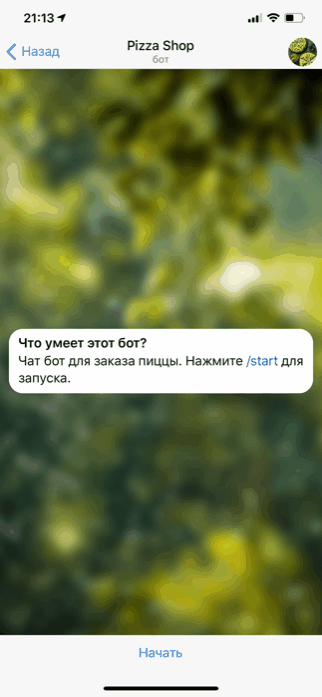
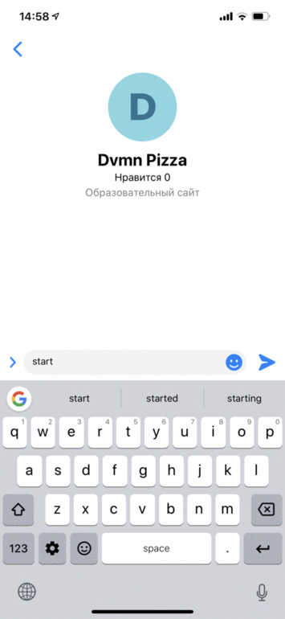

# Bot for pizza shop

It's the bot for pizzerias shop based on Moltin.

The bot can show all products, choose a product, and show its description and its image. You can buy pizza or several pizzas and place your order. To place your order, send your location via bot and pay the order via bot.

Temporality users data stored in Redis.

Bot in Telegram (find it @dvmn_pizzashop_bot):



Bot in FB Messanger:



Bot in VK(write it in [https://vk.com/club182098076](https://vk.com/im?media=&sel=-182098076)):


## How to install

1. Create your online shop on [Moltin](https://www.moltin.com), and create your goods. Get your Client ID and Client secret.

2. Create a bot in Telegram @via BotFather, and get it API token.

3. via @BotFather choose your bot, choose Payments and bank for your payments. And get Bank token.

4. Create redis account in [Redislabs](https://redislabs.com/), and after that create [cloud database](https://docs.redislabs.com/latest/rc/quick-setup-redis-cloud/) (you can choose free plan). Get your endpoint database url and port.

5. Create page in Facebook, create [Facebook's app](https://developers.facebook.com/apps/) and setting messenger permissions for it. You need to choose `messages` and `messaging_postbacks`. Get access token and write it into .env. Plug in webhook into your app.

6. For VK, you have to create public group and create app for bot.
After that create your token via [Implicit Flow](https://vk.com/dev/implicit_flow_group) and get access_token from browser

7. Some parameters you need for it:

* `client_id` = app id (get it from app setting)
* `group_ids`= id your public group,
* `redirect_uri=https://oauth.vk.com/blank.html`
* `scope=messages,photos`

Create file .env in the root and write in it:

```.env
MOLTIN_CLIENT_ID=your moitin client id
MOLTIN_CLIENT_SECRET=your moltin secret key
TG_TOKEN=your telegram bot's token
TG_TRANZZO_TOKEN=bank token for payments
PAYMENT_PAYLOAD=you very secure payload
REDIS_URL=redis database endpoint without port
REDIS_PORT=redis database port
REDIS_PASSWORD=redis password
FB_PAGE_TOKEN=your token from FB app
FB_VERIFY_TOKEN=digits for verify your webhook
VK_TOKEN=token for vk
```

Python3 must be already installed.

Should use virtual env for project isolation.

Then use pip (or pip3, if there is a conflict with Python2) to install dependencies:

```bash
pip install -r requirements.txt
```

## How run sync Telegram Bot

Set env vars:

```bash
export TG_TOKEN=token
MOLTIN_CLIENT_ID=id client
export MOLTIN_CLIENT_SECRET=client secret
export YANDEX_API_KEY=yandex key to use map
export TG_TRANZZO_TOKEN=telegram tranzo token
export PAYMENT_PAYLOAD=payload for tg payment
```

Install redis local and restart it in Ubuntu:

```bash
sudo systemctl enable redis-server.service
```

And run bot:

```bash
python async_tg_bot.py
```

## How to use

To run telegrem bot:

```bash
python tg_bot.py
```

To run facebook bot you must configure Flask webhook on the server:

To run locally use `ngrok` and run script:

```bash
python fb_bot.py
```

To run VK bot:

```bash
python vk_bot.py
```
